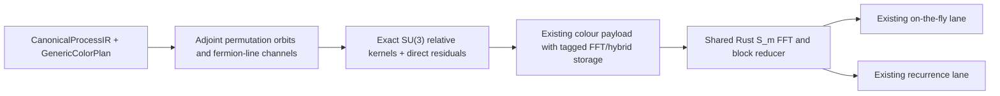

# Generic symmetric-group FFT colour contractions for pyAmpliCol

## 1. Goal and locked scope

**Goal statement — use verbatim for the implementation goal:**

> Implement an independent, model- and process-generic symmetric-group FFT colour-contraction method for pyAmpliCol, exposed as `color.contraction = "symmetric-group-fft"`, reusing the existing Rusticol on-the-fly and recurrence lanes for FullColour and NLC, retaining exact interference with arbitrary fermionic colour structures and direct residuals, matching the existing direct implementation over the required built-in-SM/UFO validation matrix, and meeting the agreed paired pure-gluon runtime, memory, and cold-to-ready targets.

- Add the generation-time enum:

  - Configuration: `color.contraction = "direct" | "symmetric-group-fft"`
  - CLI: `--color-contraction direct|symmetric-group-fft`
  - Default: `direct`
  - Changing it requires process-artifact regeneration but does not alter prepared-model/native-kernel identity.

- Support `symmetric-group-fft` for:

  - `on_the_fly`: FullColour and NLC.
  - `recurrence`: FullColour and NLC.
  - LC is rejected because it exposes colour flows rather than a contracted Gram matrix.
  - Compiled and eager modes are explicitly deferred; selecting FFT with them fails during configuration/generation with a clear diagnostic.

- Do not add a Rusticol execution lane. Preserve the current public evaluation API, selector behavior, parameter update behavior, OTF seed, and output normalization. Only dispatch the final colour reduction differently inside the existing OTF and recurrence lanes.

- Treat the method as an exact hybrid. Every certified symmetric-group orbit is Fourier transformed; quark-line channels remain explicit and fully coupled. Any genuinely incomplete residual sector and every cross term involving it are contracted directly. There is no whole-process fallback and no `auto` option.

## 2. Generic mathematical and runtime design

### Orbit/channel construction

Let \(a\) be the number of external adjoint-colour legs after all-outgoing crossing. The implementation identifies them from canonical colour roles—not PDG IDs, particle names, model type, or process strings.

- For a pure-adjoint single trace, retain pyAmpliCol’s existing deterministic cyclic anchor and use \(G=S_{a-1}\).
- With open fundamental lines, use \(G=S_a\). A channel records:

  - the fundamental–antifundamental endpoint pairing;
  - the ordered number of adjoint slots on each canonically ordered open line;
  - existing singlet attachments and canonical-owner information.

- Singlet legs are spectators.
- Whole-open-line ordering aliases are collapsed through the existing canonical owner map before orbit discovery.
- \(S_0\) and \(S_1\) are exact identity transforms and stay on the direct residual path.
- For \(a\ge2\), every candidate orbit is certified for factorial size, closure, unique destinations, and adjacent-transposition action. Structurally absent amplitudes may be filled with zero only when the existing planner provides an exact zero certificate.

For channels \(c,d\), permutation \(r\in G\), colour tensors \(C_{c,r}\), and dual amplitudes \(A_c(r)\), define

\[
R_{cd}(r)=\langle C_{c,r},C_{d,e}\rangle,\qquad
G_{c,g;d,h}=R_{cd}(h^{-1}g).
\]

Generate \(R_{cd}\) exclusively through pyAmpliCol’s existing exact SU(3) overlap algebra. Do not use the standalone’s pure-gluon \(U(3)\) cycle formula.

With the unnormalised transform

\[
\widehat A_c^\lambda=\sum_{g\in G}A_c(g)\rho_\lambda(g),\qquad
\widehat R_{cd}^\lambda=\sum_{r\in G}R_{cd}(r)\rho_\lambda(r),
\]

evaluate

\[
B=\frac{1}{|G|}
\sum_\lambda d_\lambda
\sum_{c,d}
\operatorname{Tr}\!\left[
(\widehat A_c^\lambda)^\dagger
\widehat A_d^\lambda
\widehat R_{cd}^\lambda
\right].
\]

Hermiticity gives \(\widehat R_{dc}=\widehat R_{cd}^\dagger\), so store one channel-pair triangle and pair off-diagonal contributions as \(2\operatorname{Re}\). For one pure-gluon channel this reduces to the paper’s trace formula. For `d d~ > u u~ g g g g`, it is an \(S_4\) transform over the gluon axis coupled to every quark-line channel and interference term.

This reduces colour-kernel storage from \(O(C^2|G|^2)\) to \(O(C^2|G|)\), while amplitudes remain \(O(C|G|)\). It does not pretend to remove the factorial dual-amplitude count or the channel-pair cost for many fermion lines.

### Symmetric-group FFT core

Implement an independent 0BSD Rust module from the mathematical construction:

- Build partitions, standard Young tableaux, dimensions, and branching along \(S_1\subset\cdots\subset S_m\).
- Represent adjacent transpositions by sparse Young-orthogonal \(1\times1\) and \(2\times2\) actions derived from axial distances.
- Convert the planner’s lexicographic permutation order once into the recursive coset order.
- Use the unnormalised forward transform and Plancherel normalization above.
- Separate immutable degree plans from mutable workspaces so plans can be shared while every runtime instance/thread owns its buffers.
- Transform kernels once during artifact load/warm-up, then discard raw runtime copies.
- Transform eligible amplitude channels in reusable bounded scratch, preserving destination-major, point-contiguous batching. Contract direct residual/cross terms before overwriting amplitudes with transformed values.
- Use diagonal Hermitian/symmetric and general cross-channel block microkernels; do not apply single-channel symmetry shortcuts to general cross-channel kernels.
- Warmed evaluation must allocate nothing.

### Existing payload and lanes

Extend the current recurrence colour-contraction codec rather than creating another ABI or sidecar:

- Keep `PACRCLR3` / `pyamplicol-recurrence-color-contraction-v3` initially.
- Add a distinct convolution-kernel storage discriminator and `symmetric-group-fourier` factorization kind; do not misuse the current repeated/Walsh semantics.
- Reuse current header and exact-factor/group/destination/owner arrays:

  - `component_count`: one for OTF, resolved-helicity count for recurrence.
  - `local_group_count`: local colour basis size.
  - factor rank: symmetric-group degree.
  - orbit/channel count and orbit-major/permutation-major indices.
  - exact relative-kernel rows for eligible channel pairs.
  - ordinary upper-triangle entries for direct residual and residual-cross terms.

- Add a runtime capability such as `rusticol.color-contraction.symmetric-group-fft.v1`.
- Keep `on-the-fly-color.bin` and `recurrence-color.bin`; do not add a new process schema, seed, public C API, or evaluation lane.
- Generalize recurrence’s existing factorized reducer dispatch to an enum shared by Walsh and symmetric-group FFT. Let OTF call the same reducer at its existing final-contraction seam.
- Record method, degree, orbit/channel counts, FFT-covered groups, direct residual count, raw/transformed sizes, and capability in artifact inspection/provenance.
- Backward compatibility is not an objective: add no migrations, legacy decoders, dual writes, or old-artifact acceptance tests. Freshly generated direct artifacts must work, but persisted historical internal artifacts may be invalidated.

If the required pure-gluon RSS campaign demonstrates that raw v3 kernel decoding plus transformed blocks causes the 2× RSS gate to fail, replace this codec with v4 of the same colour-contraction ABI family. V4 will store authenticated, generation-validated transformed floating-point blocks in a typed section and will replace v3 rather than maintaining both. No separate lane or sidecar is permitted.

## 3. Implementation orchestration and sequencing

### Kickoff, branch, goal, and workspace safety

At the first implementation turn:

1. Revalidate `main`, `origin/main`, the dirty-state boundary, and absence of an `fft` branch.
2. Create and switch to the exact branch `fft`.
3. Write the Markdown content of this plan between the `<proposed_plan>` tags verbatim to `FFT_FEATURE_RESOURCES/fft_implementation_plan.md`.
4. Create the persistent goal using the exact goal statement above.
5. Stage only `FFT_FEATURE_RESOURCES/fft_implementation_plan.md`; leave the PDF and nested `MultipletRecursion` repository untracked.
6. Commit the plan and push `fft` to `origin` before implementation edits.

The main agent remains the orchestrator and sole Git integrator. It owns branch operations, goal status, interface decisions, integration, test scheduling, and final pushes; broad implementation is delegated.

Use three parallel, disjoint implementation roles:

- Group-theory agent: independent Rust FFT plan/workspace, representations, transform, and dense mathematical tests.
- Planner/codec agent: configuration, generic orbit/channel discovery, exact kernels, hybrid payload, provenance, and Python tests.
- Runtime/validation agent: OTF and recurrence reducer integration, reusable scratch, benchmark harness, and acceptance machinery.

After integration, agents cross-audit code they did not author:

- mathematical convention and genericity audit;
- codec/runtime/no-new-lane and allocation audit;
- numerical/performance evidence audit.

All agents must use `/Users/vjhirsch/HEP_programs/pyAmpliCol` as the explicit working directory. Temporary files, compiler outputs, Cargo targets, caches, and reports stay under workspace-local `target/` or `.artifacts/fft-*`. No command may request elevated sandbox permissions or user approval. If a command would require escalation, use an in-workspace/local alternative; never escalate. Every build, test, generation, warm-up, and benchmark command runs under the repository’s 30 GiB memory watchdog.

### Delivery phases

1. **Mathematical prototype:** implement and validate the reusable \(S_m\) FFT through the pure-gluon degrees needed for \(N_{\text{total}}=11\), without touching production lanes.
2. **Generic planner and payload:** branch before current \(O(S^2)\) dense-metric construction, discover channels/orbits, generate \(O(C^2|G|)\) exact kernels plus residuals, and encode/inspect the new payload.
3. **OTF integration:** retain the current OTF lifecycle/query machinery and dispatch only its final reduction.
4. **Recurrence and NLC integration:** reuse the same payload/core; certify NLC orbit closure and send non-invariant truncation remnants through the exact direct residual.
5. **Performance-driven codec decision:** run the required pure-gluon campaign using v3. Move to replacement v4 only if profiling attributes a mandatory RSS failure to transient/raw kernel storage.
6. **Independent audit, final gates, commit, and push:** resolve all correctness/performance findings, complete the goal only after every mandatory acceptance criterion passes, and push the final `fft` branch.

The standalone Fortran is an algorithmic and behavioral oracle only. It has no visible license at the pinned reference commit, so no source, comments, layouts, or implementation fragments may be copied or translated. The mathematical implementation must be independent and use pyAmpliCol’s existing generic kinematic/current machinery.

## 4. Correctness and numerical acceptance

### Focused tests

- Group theory:

  - \(\sum_\lambda d_\lambda^2=m!\);
  - Young branching and tableau enumeration;
  - \(s_i^2=I\), braid, and distant-commutation relations;
  - impulses and random vectors against an independent direct representation sum;
  - Parseval identities;
  - lexicographic/coset reorder round trips;
  - reusable workspace and allocation-free warmed calls.

- Colour planner and reducer:

  - pure trace, one open line, multiple open lines, singlets, identical quark lines, \(S_0/S_1\), missing structural-zero destinations, and hybrid residuals;
  - reconstruct small dense Gram matrices from relative kernels;
  - compare FFT/hybrid results with independently expanded \(A^\dagger G A\) for random complex amplitudes;
  - verify channel-pair Hermiticity, inverse conventions, real/nonnegative final sums, owner aliasing, and fermionic signs;
  - include `d d~ > u u~ g g g g` as the focused multi-line \(S_4\) integration case;
  - NLC closure and direct residual behavior;
  - codec tampering, overflow, malformed orbit maps, capability checks, and runtime scratch reuse.

- Runtime:

  - OTF and recurrence, FullColour and NLC;
  - one and multiple points, selected helicity, all-helicity totals, parameter changes, repeated warm-up, structural zeros, and concurrent runtime instances;
  - unchanged public contracted-colour selector/output behavior.

### Process-table gate

Create a dedicated opt-in gate, separate from the existing 15-lane numerical acceptance campaign.

- Generate cases from `tools/performance_report/catalog.py`; do not duplicate the catalog.
- Here `n_final` is final-state multiplicity.
- FullColour `n_final≤5` contains 47 valid cases per model, or 94 across built-in SM and UFO-SM; the four-quark-line family starts at 6 and is absent by definition.
- For both OTF and recurrence:

  - compare direct versus FFT for one recorded, generation-time-selected nonzero helicity in all 94 cases;
  - additionally compare fully helicity-summed results for every case through `n_final=4`;
  - at `n_final=5`, require only the selected-helicity comparison;
  - use the same seed-101 phase-space point and established scale-relative tolerance \(10^{-10}\);
  - generate/cache ProcessSets at the method/model/mode/helicity-scope boundary and reuse them across cases—never regenerate per process.

- Run the same selected-helicity catalog parity for NLC, without the all-helicity expansion.
- Replay FFT UFO FullColour results through `n_final=4` against the existing frozen independent MadGraph evidence; do not rerun MadGraph.
- The required mixed-process matrix stops at `n_final=5`. Beyond it, only the focused multi-line example and pure-gluon ladder are required.
- Every invocation is wrapped in the 30 GiB watchdog.

## 5. Performance acceptance, final validation, and assumptions

Use a native same-host harness against `AmpliGluonTrace`, not a Python process. Define \(N_{\text{total}}\) as the paper’s total number of external gluons and \(n_{\text{final}}=N_{\text{total}}-2\).

Benchmark both supported FullColour lanes and designate one single winning lane—OTF or recurrence. That same lane must satisfy every mandatory row and all three gates below; metrics cannot be mixed between lanes.

- Mandatory: \(N_{\text{total}}=4\ldots9\).
- Attempt and gate \(N_{\text{total}}=10,11\) only while uncached generation and first warm-up each remain below 15 minutes and peak RSS remains below 30 GiB.
- Generate exactly one known-nonzero helicity at generation time.
- Use the reference events/settings: one core, batch size one, default-BG representative helicity, ten RAMBO-on-diet points, seeds 1733–1740, at least 0.25 seconds calibration, and median of ten warmed batches.
- Exclude initialization and the first evaluation from warmed timing.
- Measure peak RSS in a fresh native process using the same OS mechanism for candidate and reference.
- Report cold OTF/recurrence construction separately from warm evaluation.

Acceptance gates per completed row:

1. **Warm runtime:** candidate/reference median time per sample \(\le1.25\).
2. **Peak RSS:** candidate/reference fresh-process peak RSS \(\le2.0\).
3. **Cold-to-ready:**
   \[
   \frac{
   T_{\text{candidate uncached artifact generation}}
   +T_{\text{candidate load and first warm-up}}
   }{
   T_{\text{reference clean backend build}}
   +T_{\text{reference initialization and first sampled pass}}
   }\le5.
   \]
   Event generation and already-installed pyAmpliCol package compilation are excluded from both sides.

The absolute paper warm-time sequence remains a sanity reference, not the cross-hardware gate: 0.968 μs, 4.41 μs, 26.2 μs, 0.186 ms, 1.62 ms, 15.5 ms, 0.215 s, and 3.08 s for \(N_{\text{total}}=4\ldots11\). The paired run is authoritative because the available host is Apple M3 Pro with GNU Fortran 14.2 rather than the paper’s i7-8700K/GNU Fortran 13.3 setup.

Add lean, explicit developer targets such as `just fft-numerical-acceptance` and `just fft-performance-acceptance`; keep hardware-sensitive performance out of default CI. During development run focused tests only, then run once:

1. focused Python/Rust FFT tests;
2. the dedicated numerical gate;
3. the paired performance/RSS/cold campaign;
4. one final candidate `source-gate`, itself inside the 30 GiB watchdog.

Do not duplicate this with the full legacy performance campaign, an additional complete test suite, release packaging, or compatibility validation.

Assumptions and non-goals:

- “Generic” covers every current canonical SU(3) colour topology using singlet, fundamental, antifundamental, and adjoint roles, for built-in and UFO models; it does not generalize to arbitrary gauge groups or exotic representations.
- All external adjoint-colour legs after crossing participate in the largest valid group; initial gluons are not held fixed.
- Kinematics, vertices, masses, spins, flavours, couplings, and model provenance remain opaque to the colour FFT.
- Full and NLC results remain exact up to floating-point rounding; NLC and recurrence have no paper-derived performance threshold.
- Compiled/eager support, LC flows, historical artifact compatibility, and vendoring the supplied resources are out of scope.
- The authoritative algorithm/performance source is [gluon_colour_sums.pdf](</Users/vjhirsch/HEP_programs/pyAmpliCol/FFT_FEATURE_RESOURCES/gluon_colour_sums.pdf>); the standalone is used only for same-host behavioral and performance comparison. :codex-file-citation{path="/Users/vjhirsch/HEP_programs/pyAmpliCol/FFT_FEATURE_RESOURCES/gluon_colour_sums.pdf" purpose="source"}
